<h1>Rapport Projet Hospitalier(Gestion Patients) securisé</h1>

Entité Patient

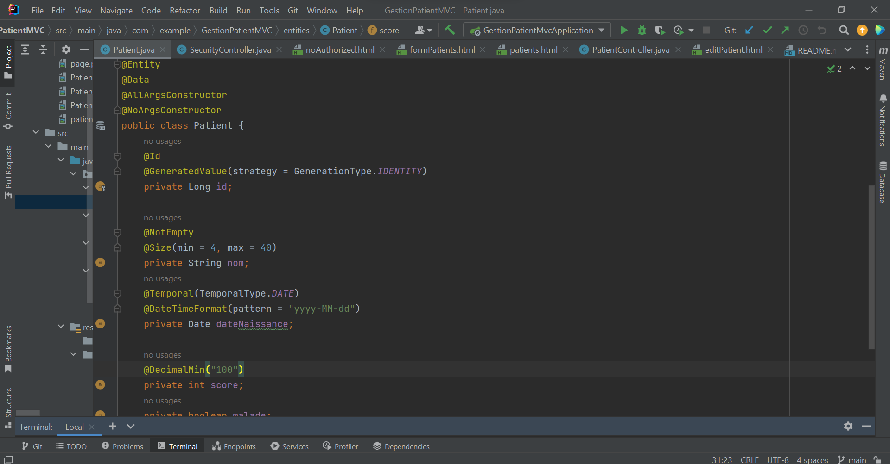

Patient repository

Patient Controller

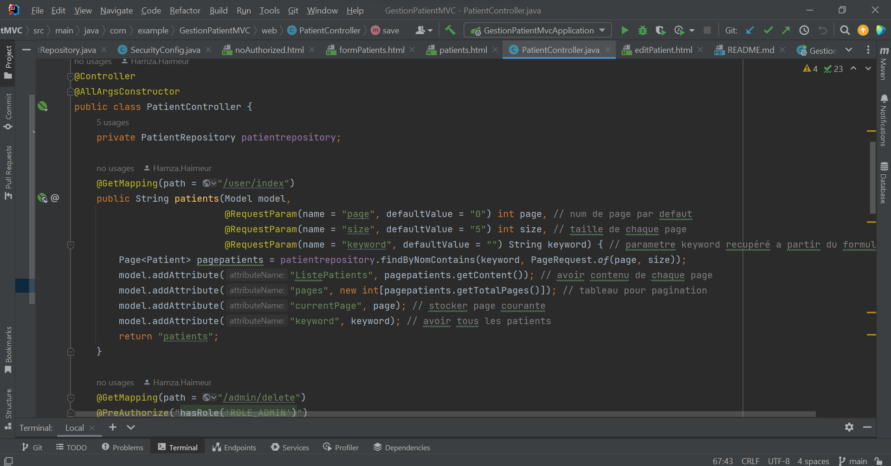
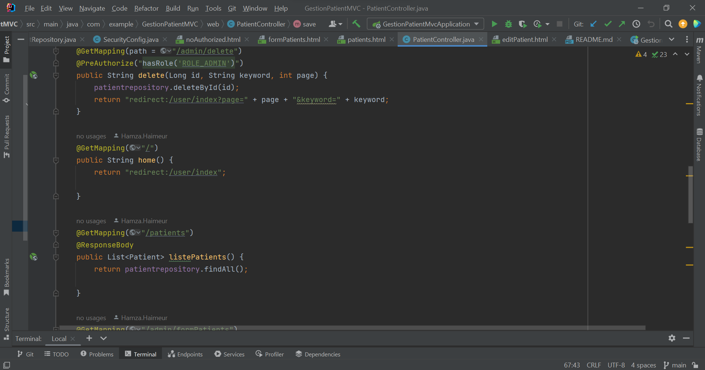
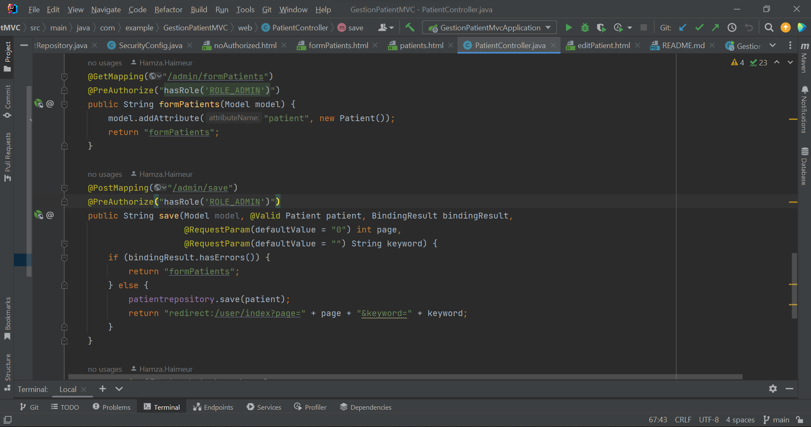

Securité Controller

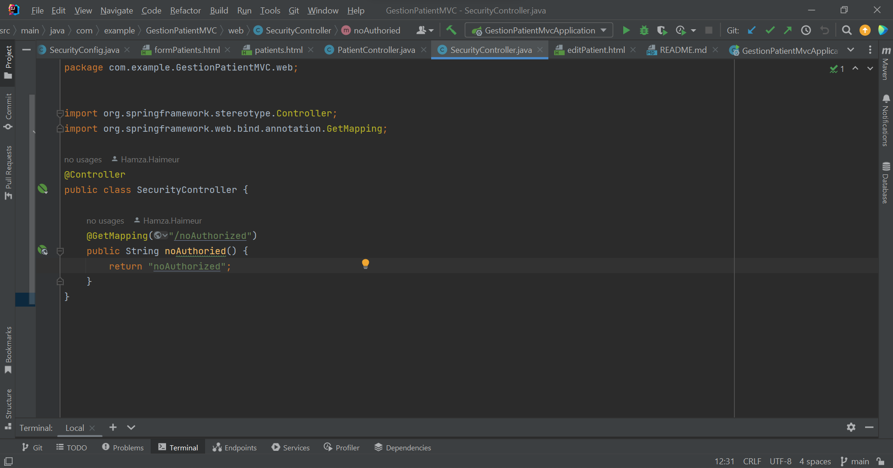

Configuration securité

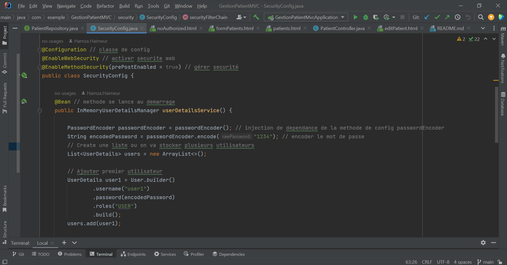
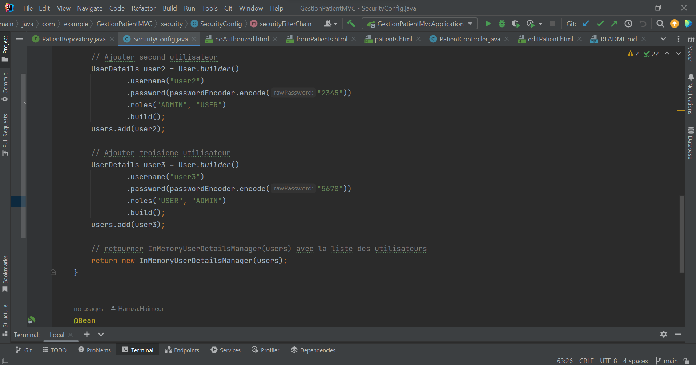
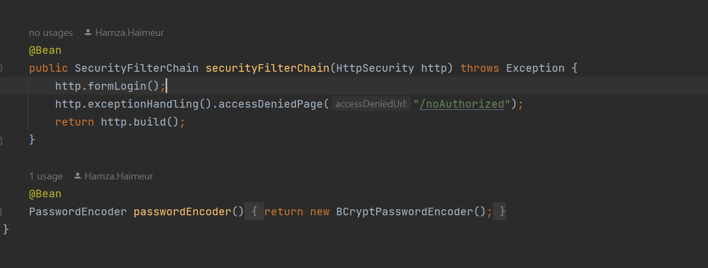

Template de decoration

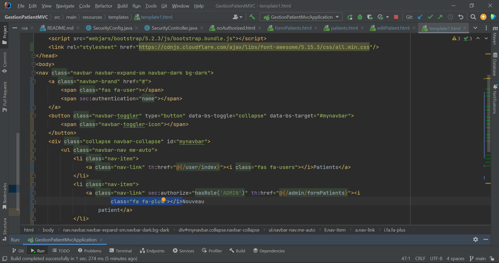

Page patients

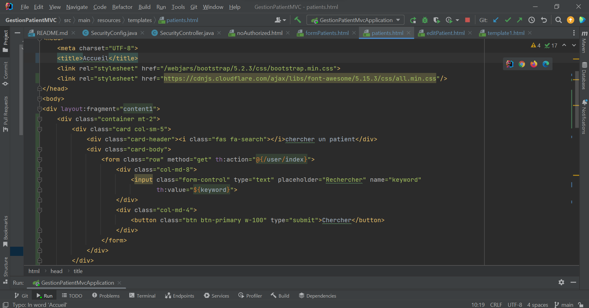
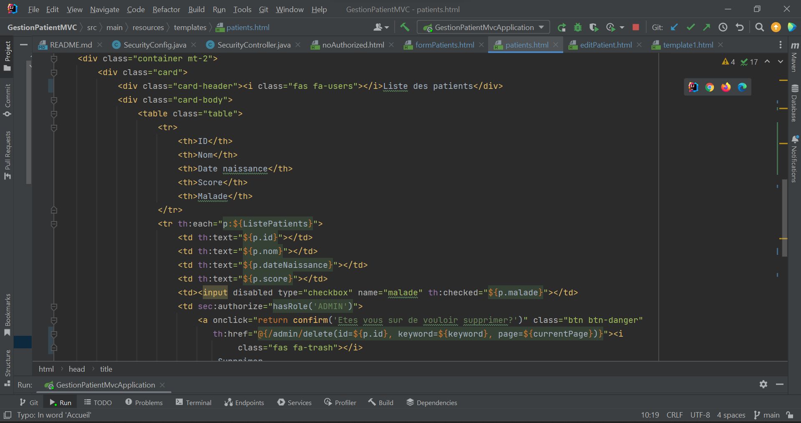

Formulaire ajout

Modifier patients

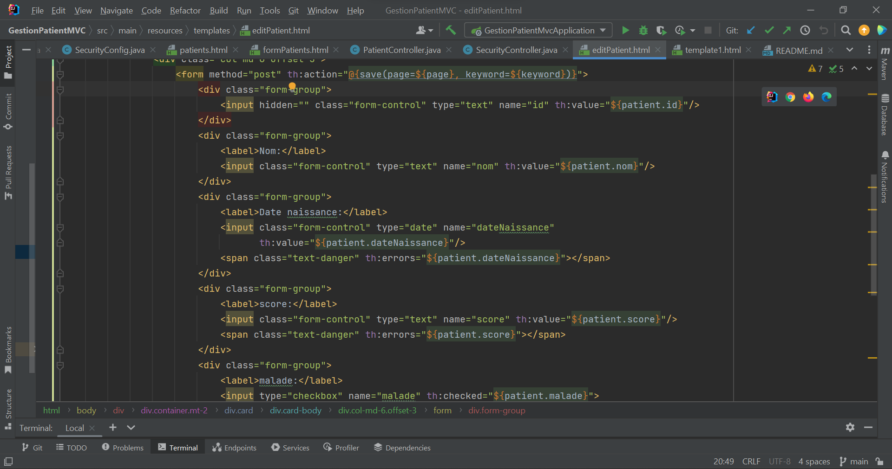

NoAuthorized page

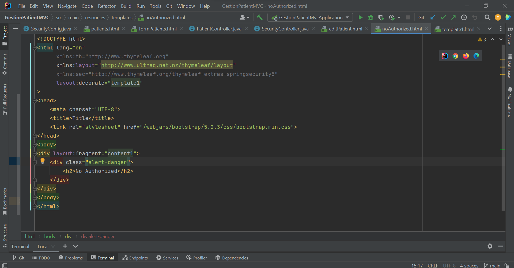

main

propriétes app

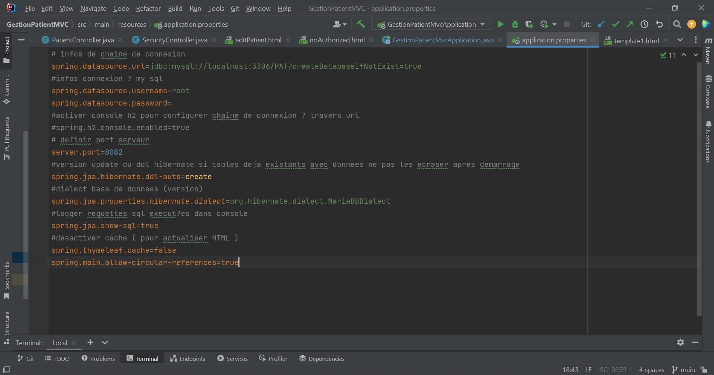