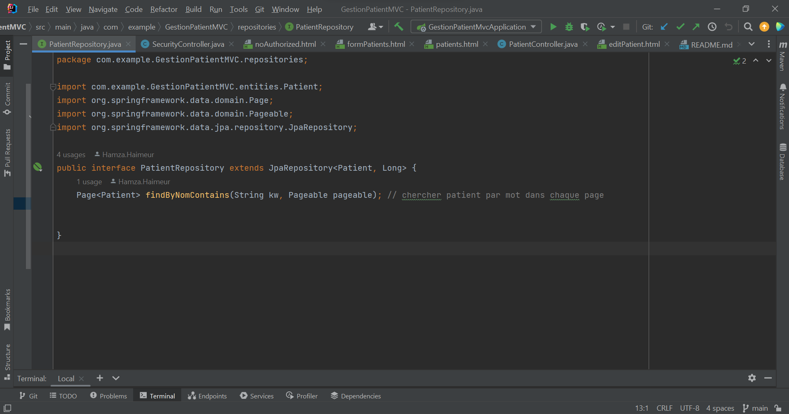

<h1>Rapport Projet Hospitalier(Gestion Patients) securisé</h1>

Entité Patient

Patient repository

Patient Controller

Securité Controller

Configuration securité

Template de decoration

Page patients

Formulaire ajout

Modifier patients

NoAuthorized page

main

propriétes app

